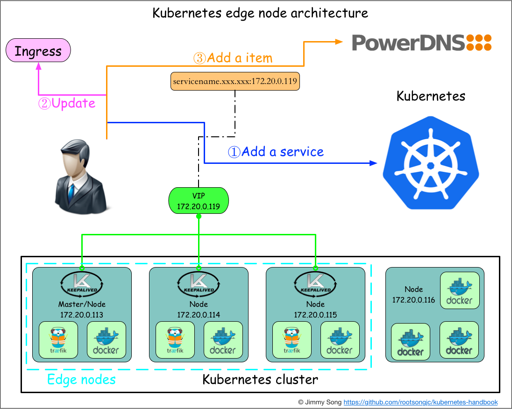
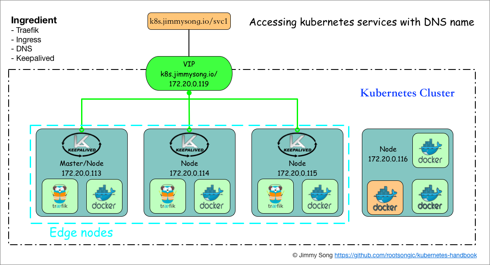

# 边缘节点配置

为了配置 kubernetes 中的 traefik ingress 的高可用，对于 kubernetes 集群以外只暴露一个访问入口，需要使用 keepalived 排除单点问题。本文参考了 [kube-keepalived-vip](https://github.com/kubernetes/contrib/tree/master/keepalived-vip)，但并没有使用容器方式安装，而是直接在 node 节点上安装。

## 定义

首先解释下什么叫边缘节点（Edge Node），所谓的边缘节点即集群内部用来向集群外暴露服务能力的节点，集群外部的服务通过该节点来调用集群内部的服务，边缘节点是集群内外交流的一个 Endpoint。

**边缘节点要考虑两个问题**

- 边缘节点的高可用，不能有单点故障，否则整个 kubernetes 集群将不可用
- 对外的一致暴露端口，即只能有一个外网访问 IP 和端口

## 架构

为了满足边缘节点的以上需求，我们使用 [keepalived](http://www.keepalived.org/) 来实现。

在 Kubernetes 中添加了 service 的同时，在 DNS 中增加一个记录，这条记录需要跟 ingress 中的 `host` 字段相同，IP 地址即 VIP 的地址，本示例中是 `172.20.0.119`，这样集群外部就可以通过 service 的 DNS 名称来访问服务了。

选择 Kubernetes 的三个 node 作为边缘节点，并安装 keepalived，下图展示了边缘节点的配置，同时展示了向 Kubernetes 中添加服务的过程。



## 准备

复用 Kubernetes 测试集群的三台主机，其 IP 地址如下：

- 172.20.0.113
- 172.20.0.114
- 172.20.0.115

## 安装

使用 keepalived 管理 VIP，VIP 是使用 IPVS 创建的，IPVS 已经成为 linux 内核的模块，不需要安装

LVS 的工作原理请参考：[http://www.cnblogs.com/codebean/archive/2011/07/25/2116043.html](https://www.cnblogs.com/codebean/archive/2011/07/25/2116043.html)

不使用镜像方式安装了，直接手动安装，指定三个节点为边缘节点（Edge node）。

因为我们的测试集群一共只有三个 node，所有在在三个 node 上都要安装 keepalived 和 ipvsadmin。

```bash
yum install keepalived ipvsadm
```

## 配置说明

需要对原先的 traefik ingress 进行改造，从以 Deployment 方式启动改成 DeamonSet。还需要指定一个与 node 在同一网段的 IP 地址作为 VIP，我们指定成 172.20.0.119，配置 keepalived 前需要先保证这个 IP 没有被分配。。

- Traefik 以 DaemonSet 的方式启动
- 通过 nodeSelector 选择边缘节点
- 通过 hostPort 暴露端口
- 当前 VIP 漂移到了 172.20.0.115 上
- Traefik 根据访问的 host 和 path 配置，将流量转发到相应的 service 上

## 配置 keepalived

参考[基于 keepalived 实现 VIP 转移，lvs，nginx 的高可用](http://limian.blog.51cto.com/7542175/1301776)，keepalived 的配置参考其[官方配置文档](http://keepalived.org/pdf/UserGuide.pdf)。

配置文件 `/etc/keepalived/keepalived.conf` 文件内容如下：

```ini
! Configuration File for keepalived

global_defs {
   notification_email {
     root@localhost
   }
   notification_email_from kaadmin@localhost
   smtp_server 127.0.0.1
   smtp_connect_timeout 30
   router_id LVS_DEVEL
}

vrrp_instance VI_1 {
    state MASTER
    interface eth0
    virtual_router_id 51
    priority 100
    advert_int 1
    authentication {
        auth_type PASS
        auth_pass 1111
    }
    virtual_ipaddress {
        172.20.0.119
    }
}

virtual_server 172.20.0.119 80{
    delay_loop 6
    lb_algo loadbalance
    lb_kind DR
    nat_mask 255.255.255.0
    persistence_timeout 0
    protocol TCP

    real_server 172.20.0.113 80{
        weight 1
        TCP_CHECK {
        connect_timeout 3
        }
    }
    real_server 172.20.0.114 80{
        weight 1
        TCP_CHECK {
        connect_timeout 3
        }
    }
    real_server 172.20.0.115 80{
        weight 1
        TCP_CHECK {
        connect_timeout 3
        }
    }
}
```

`Realserver` 的 IP 和端口即 traefik 供外网访问的 IP 和端口。

将以上配置分别拷贝到另外两台 node 的 `/etc/keepalived` 目录下。

我们使用转发效率最高的 `lb_kind DR` 直接路由方式转发，使用 TCP_CHECK 来检测 real_server 的 health。

设置 keepalived 为开机自启动：

```bash
chkconfig keepalived on
```

**启动 keepalived**

```
systemctl start keepalived
```

三台 node 都启动了 keepalived 后，观察 eth0 的 IP，会在三台 node 的某一台上发现一个 VIP 是 172.20.0.119。

```bash
$ ip addr show eth0
2: eth0: <BROADCAST,MULTICAST,UP,LOWER_UP> mtu 1500 qdisc mq state UP qlen 1000
    link/ether f4:e9:d4:9f:6b:a0 brd ff:ff:ff:ff:ff:ff
    inet 172.20.0.115/17 brd 172.20.127.255 scope global eth0
       valid_lft forever preferred_lft forever
    inet 172.20.0.119/32 scope global eth0
       valid_lft forever preferred_lft forever
```

关掉拥有这个 VIP 主机上的 keepalived，观察 VIP 是否漂移到了另外两台主机的其中之一上。

## 改造 Traefik

在这之前我们启动的 traefik 使用的是 deployment，只启动了一个 pod，无法保证高可用（即需要将 pod 固定在某一台主机上，这样才能对外提供一个唯一的访问地址），现在使用了 keepalived 就可以通过 VIP 来访问 traefik，同时启动多个 traefik 的 pod 保证高可用。

配置文件 `traefik.yaml` 内容如下：

```yaml
apiVersion: extensions/v1beta1
kind: DaemonSet
metadata:
  name: traefik-ingress-lb
  namespace: kube-system
  labels:
    k8s-app: traefik-ingress-lb
spec:
  template:
    metadata:
      labels:
        k8s-app: traefik-ingress-lb
        name: traefik-ingress-lb
    spec:
      terminationGracePeriodSeconds: 60
      hostNetwork: true
      restartPolicy: Always
      serviceAccountName: ingress
      containers:
      - image: traefik
        name: traefik-ingress-lb
        resources:
          limits:
            cpu: 200m
            memory: 30Mi
          requests:
            cpu: 100m
            memory: 20Mi
        ports:
        - name: http
          containerPort: 80
          hostPort: 80
        - name: admin
          containerPort: 8580
          hostPort: 8580
        args:
        - --web
        - --web.address=:8580
        - --kubernetes
      nodeSelector:
        edgenode: "true"
```

注意，我们使用了 `nodeSelector` 选择边缘节点来调度 traefik-ingress-lb 运行在它上面，所有你需要使用：

```
kubectl label nodes 172.20.0.113 edgenode=true
kubectl label nodes 172.20.0.114 edgenode=true
kubectl label nodes 172.20.0.115 edgenode=true
```

给三个 node 打标签。

查看 DaemonSet 的启动情况：

```bash
$ kubectl -n kube-system get ds
NAME                 DESIRED   CURRENT   READY     UP-TO-DATE   AVAILABLE   NODE-SELECTOR                              AGE
traefik-ingress-lb   3         3         3         3            3           edgenode=true                              2h
```

现在就可以在外网通过 172.20.0.119:80 来访问到 traefik ingress 了。

## 使用域名访问 Kubernetes 中的服务

现在我们已经部署了以下服务：

- 三个边缘节点，使用 Traefik 作为 Ingress controller
- 使用 keepalived 做的 VIP（虚拟 IP）172.20.0.119

这样在访问该 IP 的时候通过指定不同的 `Host` 来路由到 kubernetes 后端服务。这种方式访问每个 Service 时都需要指定 `Host`，而同一个项目中的服务一般会在同一个 Ingress 中配置，使用 `Path` 来区分 Service 已经足够，这时候只要为 VIP（172.20.0.119）来配置一个域名，所有的外部访问直接通过该域名来访问即可。

如下图所示：



## 参考

- [kube-keepalived-vip - github.com](https://github.com/kubernetes/contrib/tree/master/keepalived-vip)
- [keepalived 官方网站 - keepalived.org](http://www.keepalived.org/)
- [LVS 简介及使用 - cnblogs.com](http://www.cnblogs.com/codebean/archive/2011/07/25/2116043.html)
- [基于 keepalived 实现VIP转移，lvs，nginx 的高可用 - blog.51cto.com](https://blog.51cto.com/limian/1301776)
